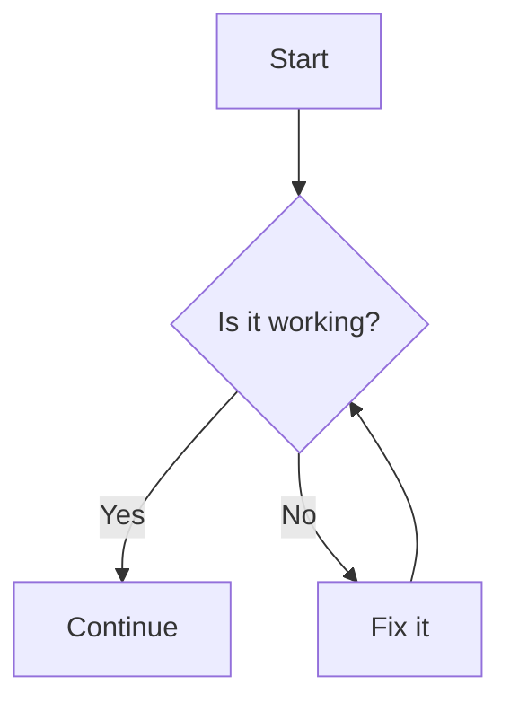
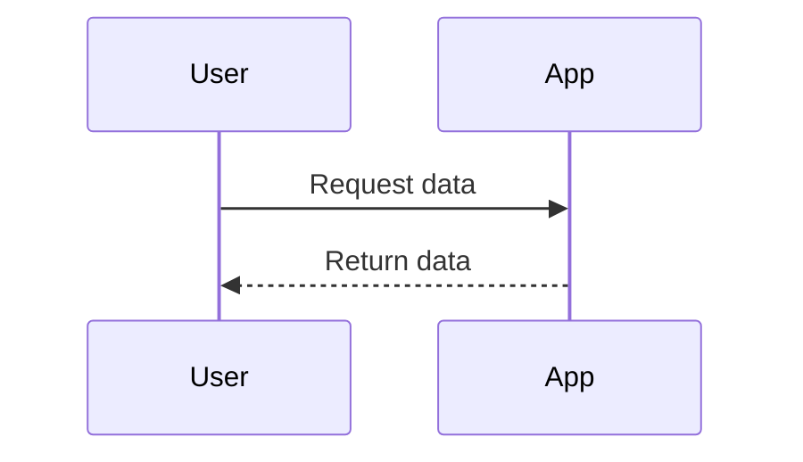
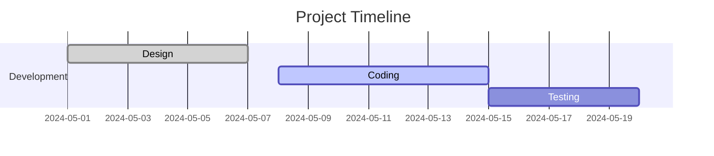

<!-- [[titlepage]] -->

# Markdown to PDF : a guide for the Open Regulatory Compliance Working Group

> **Note**
> This document demonstrates the different styles and elements that can be included. The title page prior to this first page was generated because the title page tag was set at the beginning of the document :

```html
<!-- [[titlepage]] -->
```

> The table of content on the next page is created where the table of content tag is set :

```html
<!-- [[toc]] -->
```

> The table of content defaults to using H2 and H3 headings. If you need to use more heading levels, you can do so by adding an array of levels after the tag :

```html
<!-- [[toc]][3,4,5] -->
```

<!-- [[toc]] -->

## Headings

# H1 is for the document's title

It displays mid-page and should be used once. If it contains a semicolon, it will be split into two parts for better visual impact.

## H2 is for section headings

They will always generate a page break.

### H3 is for subsection headings

They do not generate a page break unless they'd be at the end of a page.

#### H4

##### H5

###### H6

```markdown
# H1 Heading
## H2 Heading
### H3 Heading
#### H4 Heading
##### H5 Heading
###### H6 Heading
```

---

## Text Formatting

The basic text formattings can be achieved easily:

- *Italic*
- **Bold**
- ***Bold Italic***
- ~~Strikethrough~~
- <sup>Superscript</sup>
- <sub>Subscript</sub>
- `Inline code`

```markdown
*Italic*
**Bold**
***Bold Italic***
~~Strikethrough~~
<sup>Superscript</sup>
<sub>Subscript</sub>
`Inline code`
```

---

## Lists

### Unordered

- Item 1
  - Subitem 1.1
    - Subitem 1.1.1
- Item 2

### Ordered

1. First
2. Second
   1. Second - subitem
   2. Second - subitem 2
3. Third

```markdown
- Item 1
  - Subitem 1.1
    - Subitem 1.1.1
- Item 2

1. First
2. Second
   1. Second - subitem
   2. Second - subitem 2
3. Third
```

---

## Links & Images

- [GitHub](https://github.com)
- 

```markdown
[GitHub](https://github.com)

```

---

## Blockquotes & Callouts

> This is a standard blockquote.

<!-- [[legal]] -->
> This one displays as a normal blockquote in github, and I can style it later, and we could directly throw in metadata on the law text to display nicely if usefull.

> [!Note]
> This is a GitHub note callout.

> [!Warning]
> This is a GitHub warning callout.

> [!Tip]
> This is a GitHub tip callout.

> [!Important]
> This is a GitHub important callout.

> [!Caution]
> This is a GitHub caution callout.

```markdown
> This is a standard blockquote.

> [!Note]
> This is a GitHub note callout.

> [!Warning]
> This is a GitHub warning callout.

> [!Tip]
> This is a GitHub tip callout.

> [!Important]
> This is a GitHub important callout.

> [!Caution]
> This is a GitHub caution callout.
```

---

## Code

### Inline

Here is some `inline code`.

### Block

```python
def hello_world():
    print("Hello, world!")
```

```bash
# Bash example
echo "Hello, Markdown!"
```

```markdown
`inline code`
```

```python
def hello_world():
    print("Hello, world!")
```

```bash
echo "Hello, Markdown!"
```

---

## Tables

| Syntax      | Description     | Example           |
|-------------|-----------------|-------------------|
| Header      | Title           | Example Header    |
| Paragraph   | Text            | Example Text      |

```markdown
| Syntax      | Description     | Example           |
|-------------|-----------------|-------------------|
| Header      | Title           | Example Header    |
| Paragraph   | Text            | Example Text      |
```

---

## Task Lists

- [x] Write the introduction
- [ ] Add more examples
- [ ] Review the document

```markdown
- [x] Write the introduction
- [ ] Add more examples
- [ ] Review the document
```

---

## Footnotes

Here is a simple footnote.[^1] And another reference to it.[^1]

[^1]: This is the footnote.

```markdown
Here is a simple footnote.[^1] And another reference to it.[^1]

[^1]: This is the footnote.
```

---

## Horizontal Rule

---

```markdown
---
```

---

## HTML Block

<div style="color: red; font-weight: bold;">This is a raw HTML block in Markdown.</div>

```markdown
<div style="color: red; font-weight: bold;">This is a raw HTML block in Markdown.</div>
```

## Mermaid.js graphics

### Flowchart Example



### Sequence Diagram Example



### Gantt Chart Example


