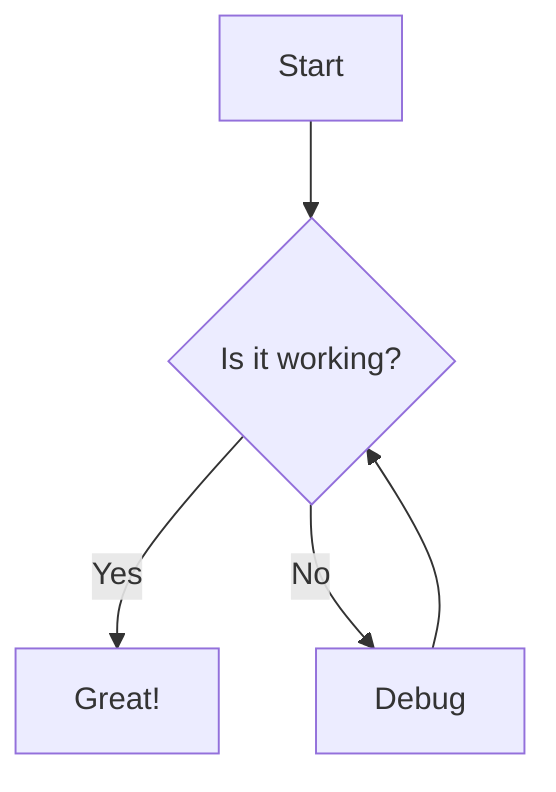
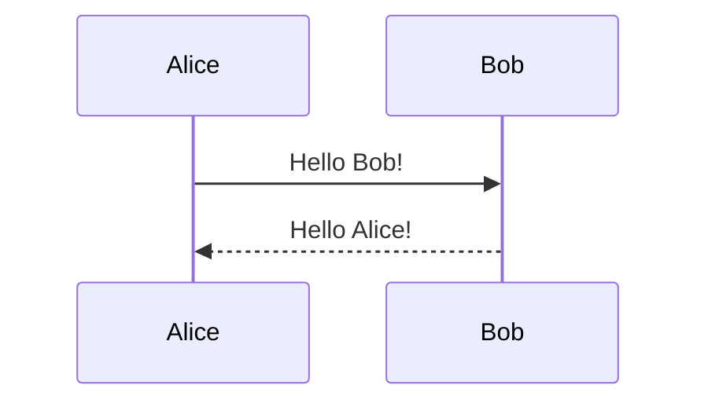

<!-- [[titlepage]] -->

# Test Case: Comprehensive Markdown Elements

> **Note**
> This document demonstrates a wide variety of Markdown features and GitHub callout styles.

<!-- [[toc]] -->

## Headings

# H1

## H2

### H3

#### H4

##### H5

###### H6

---

## Text Formatting

- *Italic*
- **Bold**
- ***Bold Italic***
- ~~Strikethrough~~
- <sup>Superscript</sup>
- <sub>Subscript</sub>
- `Inline code`

---

## Lists

### Unordered

- Item 1
  - Subitem 1.1
    - Subitem 1.1.1
- Item 2

### Ordered

1. First
2. Second
   1. Second - subitem
   2. Second - subitem 2
3. Third

---

## Links & Images

- [GitHub](https://github.com)
- 

---

## Blockquotes & Callouts

> This is a standard blockquote.

<!-- legal excerpt -->
> This one displays as a normal blockquote in github, and I can style it later, and we could directly throw in metadata on the law text to display nicely if usefull.

> [!Note]
> This is a GitHub note callout.

> [!Warning]
> This is a GitHub warning callout.

> [!Tip]
> This is a GitHub tip callout.

> [!Important]
> This is a GitHub important callout.

> [!Caution]
> This is a GitHun caution callout.

---

## Code

### Inline

Here is some `inline code`.

### Block

```python
def hello_world():
    print("Hello, world!")
```

```bash
# Bash example
echo "Hello, Markdown!"
```

---

## Tables

| Name     | Value | Description         |
|----------|-------|---------------------|
| Alpha    | 1     | First entry         |
| Beta     | 2     | Second entry        |
| Gamma    | 3     | Third entry         |

---

## CRA inventory lists

- [Inventory List Syntax](#) When we find a details tag inside a unordered list, we convert it as follows to generate the CRA inventory list items.
  <details>
    <summary>More info</summary>

  - **URL:** <https://www.markdownguide.org/basic-syntax/#lists>
  - **Publisher:** Markdown Guide
  - **License:** CC BY-SA 4.0
  - **Publication date:** 2025
  </details>
- [Details/Summary Example](https://developer.mozilla.org/en-US/docs/Web/HTML/Element/details) - This item shows how to use the `<details>` and `<summary>` HTML tags inside Markdown for collapsible sections. The description itself explains that this is a demonstration of expandable content within a Markdown list.
  <details>
    <summary>More info</summary>

  - **URL:** <https://developer.mozilla.org/en-US/docs/Web/HTML/Element/details>
  - **Publisher:** MDN Web Docs
  - **License:** CC BY-SA 2.5
  - **Type:** HTML Reference
  - **Publication date:** 2025
  </details>

---

## Task Lists

- [x] Write test case
- [ ] Review content
- [ ] Add more examples

---

## Horizontal Rule

---

## Mermaid

### Here's a flowchart



### And a sequence diagram



## Footnotes

Here is a statement with a footnote.[^1]

[^1]: This is the footnote text.
